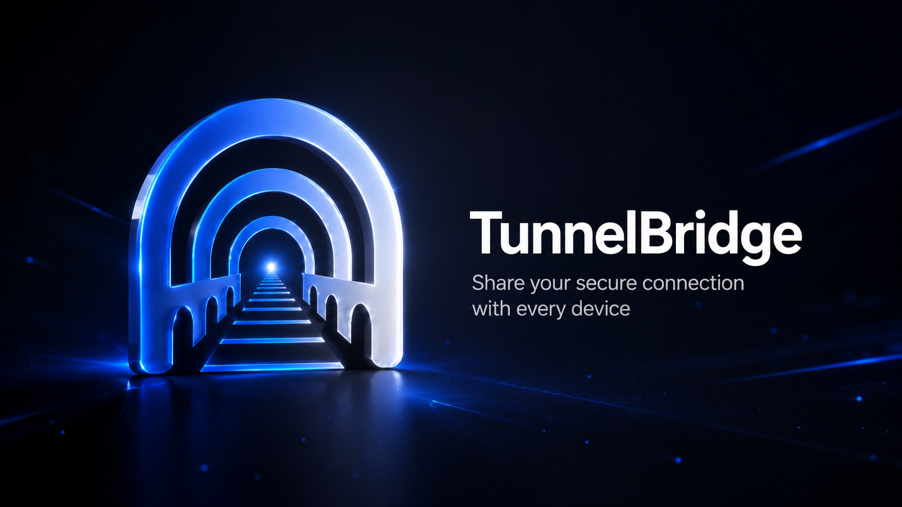
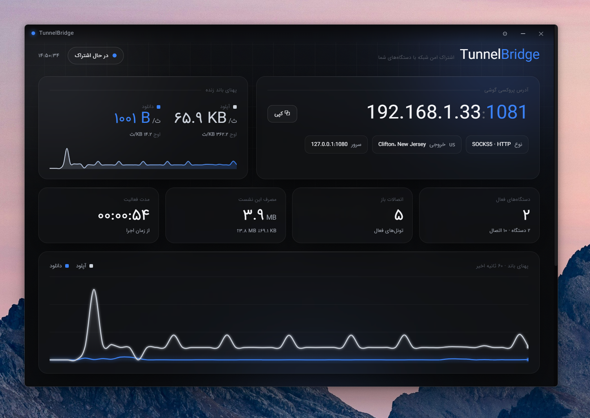
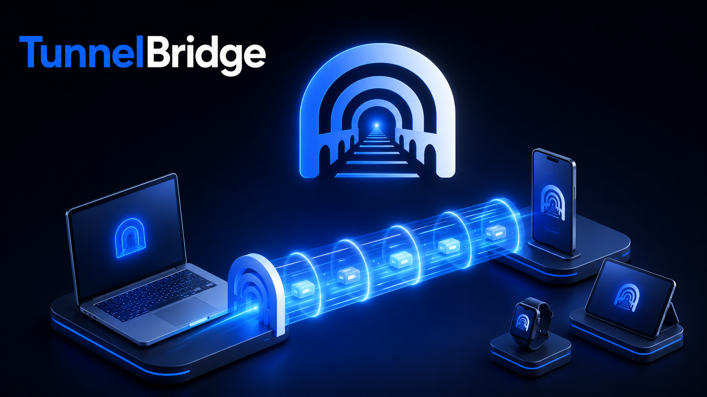

<p align="center">
  
</p>

<p align="center">
  
  
  
  
</p>

<h1 align="center">TunnelBridge · تونل‌بریج</h1>

<div dir="rtl" align="right">

<h2 align="right">🔗 تونل‌بریج چیست؟</h2>

<p dir="rtl" align="right">
<b>تونل‌بریج</b> یک برنامه‌ی دسکتاپ ویندوز است که اتصال <b>VPN</b> فعال روی کامپیوتر شما را با سایر دستگاه‌هایتان — گوشی، تبلت، لپ‌تاپ — روی همان شبکه‌ی Wi-Fi به اشتراک می‌گذارد. کافی است VPN روی کامپیوتر روشن باشد؛ تونل‌بریج همان اتصال امن را به گوشی شما می‌رساند، همراه با یک داشبورد زنده برای دیدن این‌که چه کسی متصل است و چقدر مصرف می‌کند.
</p>

<h2 align="right">🤔 چرا تونل‌بریج؟</h2>

<p dir="rtl" align="right">
بسیاری از VPNها (مثل <b>TurboVPN</b> با پروتکل ShadowsocksR) یک پروکسی محلی فقط روی <code>127.0.0.1</code> باز می‌کنند و اجازه نمی‌دهند هیچ دستگاه دیگری به آن وصل شود. تونل‌بریج این محدودیت را برطرف می‌کند: روی پورت شبکه گوش می‌دهد، اتصال گوشی شما را می‌پذیرد و آن را از طریق <code>localhost</code> به پروکسی VPN منتقل می‌کند — درست انگار که خودِ کامپیوتر درخواست داده است. به این ترتیب گوشی شما هم از همان اینترنت آزاد استفاده می‌کند.
</p>

<h2 align="right">✨ ویژگی‌ها</h2>

<ul dir="rtl" align="right">
  <li>📡 <b>اشتراک اتصال VPN</b> با گوشی و دستگاه‌های دیگر، بدون نیاز به کارت وای‌فای یا تنظیمات پیچیده</li>
  <li>📊 <b>داشبورد زنده:</b> سرعت آپلود/دانلود لحظه‌ای، نمودار پهنای باند ۶۰ ثانیه‌ی اخیر، و مصرف کل</li>
  <li>📱 <b>مدیریت دستگاه‌ها:</b> نام‌گذاری دلخواه، مشاهده‌ی مصرف و سرعت هر دستگاه، و <b>مسدود کردن</b> فوری</li>
  <li>🌎 <b>نمایش موقعیت خروج VPN</b> (کشور و شهر سرور)</li>
  <li>🔍 <b>تشخیص خودکار پورت پروکسی</b> — با هر VPNی کار می‌کند: TurboVPN، V2Ray، Clash، Shadowsocks و …</li>
  <li>🎨 <b>کاملاً فارسی و راست‌به‌چپ</b>، با تم تیره‌ی مشکی-سفید و رنگ آبی</li>
  <li>📦 <b>قابل‌حمل و بدون نصب</b> — یک فایل اجرایی؛ Python یا چیز دیگری لازم نیست</li>
  <li>🔒 <b>حریم خصوصی کامل</b> — همه‌چیز روی دستگاه شما اجرا می‌شود و هیچ داده‌ای بیرون نمی‌رود</li>
</ul>

<h2 align="right">🖥️ نمایی از برنامه</h2>

</div>

<p align="center">
  
</p>

<div dir="rtl" align="right">

<h2 align="right">⚙️ چطور کار می‌کند؟</h2>

</div>

<p align="center">
  
</p>

<div dir="rtl" align="right">

<ol dir="rtl" align="right">
  <li>VPN خود (مثلاً TurboVPN) را روی کامپیوتر روشن و متصل کنید.</li>
  <li><code>TunnelBridge.exe</code> را اجرا کنید و روی پیام ویندوز <b>«بله / Yes»</b> بزنید (برای باز کردن خودکار فایروال).</li>
  <li>گوشی را به <b>همان Wi-Fi</b> وصل کنید و در تنظیمات Wi-Fi، پروکسی را روی <b>دستی (Manual)</b> بگذارید و آدرس و پورتی که برنامه نشان می‌دهد را وارد کنید (مثلاً <code>192.168.1.33</code> پورت <code>1081</code>).</li>
  <li>تمام! حالا گوشی شما از همان VPN استفاده می‌کند و می‌توانید مصرف و سرعت را زنده ببینید.</li>
</ol>

<h2 align="right">⬇️ دانلود و نصب</h2>

<p dir="rtl" align="right">
آخرین نسخه‌ی آماده‌ی اجرا را از بخش <b>Releases</b> دریافت کنید:
</p>

</div>

<p align="center">
  <a href="../../releases/latest">
    
  </a>
</p>

<div dir="rtl" align="right">

<p dir="rtl" align="right">
فایل قابل‌حمل است؛ کافی است آن را اجرا کنید — نیازی به نصب نیست.
</p>

<h2 align="right">🔧 پشتیبانی از سایر VPNها (تنظیمات)</h2>

<p dir="rtl" align="right">
تونل‌بریج هنگام اجرا به‌صورت خودکار پورت پروکسی VPN شما را پیدا می‌کند. اگر از VPN دیگری استفاده می‌کنید یا پورت به‌صورت خودکار پیدا نشد، روی آیکن <b>⚙ تنظیمات</b> در نوار بالای برنامه بزنید و:
</p>

<ul dir="rtl" align="right">
  <li>دکمه‌ی <b>«تشخیص خودکار»</b> را بزنید تا پورت پروکسی شناسایی شود، یا</li>
  <li>پورت پروکسی، آدرس سرور و پورت اشتراک را دستی وارد کنید.</li>
</ul>

<h2 align="right">🛠️ ساخت از روی سورس</h2>

<p dir="rtl" align="right">
برای ساختن نسخه‌ی اجرایی از روی کد (نیازمند <b>Node.js</b>):
</p>

</div>

```bash
cd desktop
npm install            # نصب وابستگی‌ها
npm run dist           # خروجی: desktop/release/TunnelBridge.exe
```

<div dir="rtl" align="right">

<p dir="rtl" align="right">برای اجرای حالت توسعه:</p>

</div>

```bash
cd desktop
npm run build:vite     # ساخت رابط کاربری (React)
npm start              # اجرای برنامه
```

<div dir="rtl" align="right">

<h2 align="right">🧩 ساختار پروژه</h2>

<ul dir="rtl" align="right">
  <li><code>desktop/electron/</code> — پردازه‌ی اصلی Electron: موتور رله (Node)، تشخیص پروکسی، فایروال و IPC</li>
  <li><code>desktop/src/</code> — رابط کاربری React (داشبورد فارسی/RTL)</li>
  <li><code>desktop/build/</code> — آیکن برنامه</li>
  <li><code>IRANSansWeb.ttf</code> — فونت داخلی برنامه</li>
</ul>

<h2 align="right">🔒 حریم خصوصی</h2>

<p dir="rtl" align="right">
تونل‌بریج صرفاً یک پل محلی است. هیچ آمار یا داده‌ای جمع‌آوری یا ارسال نمی‌کند؛ تمام پایش و اطلاعات فقط روی همان کامپیوتر شما باقی می‌ماند.
</p>

<h2 align="right">📝 مجوز</h2>

<p dir="rtl" align="right">
این پروژه آزاد است و می‌توانید آزادانه از آن استفاده کنید و آن را با دوستانتان به اشتراک بگذارید. 💙
</p>

</div>

<p align="center"><sub>Made with 💙 for free and open internet · ساخته‌شده برای اینترنت آزاد</sub></p>
